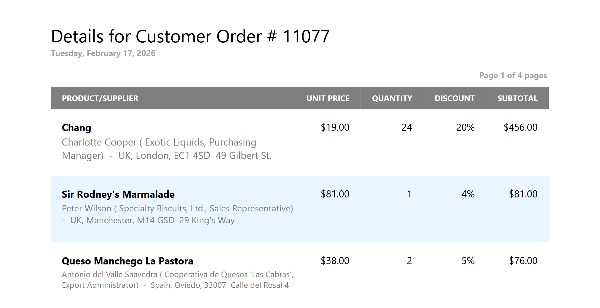

<!-- default badges list -->

[](https://supportcenter.devexpress.com/ticket/details/T1321018)
[](https://docs.devexpress.com/GeneralInformation/403183)
[](#does-this-example-address-your-development-requirementsobjectives)
<!-- default badges end -->

# DevExpress VCL Reports — Generate Reports in a Backend / Service Application

This example uses DevExpress Reports for Delphi/C++Builder to generate reports in a command line application.
The application accepts an order ID parameter, queries the database for order data,
and exports an "order" report as a PDF file.

This example bypasses the DevExpress Report Viewer dialog and generates a report
using the DevExpress Reports backend.
Use the approach demonstrated in this sample project to implement
REST/Web API backends, Windows Services, workflows, and scheduled jobs.
This approach can be particularly beneficial for the following usage scenarios
(reports generated without direct user interaction):

-   Mass-export reports to PDF, DOCX, image, and other formats.
-   Share, email, and print report documents silently.
-   Implement custom report management UIs.

---



---

## Prerequisites

[DevExpress Reports Prerequisites][req]

[req]: https://docs.devexpress.com/VCL/405773/ExpressCrossPlatformLibrary/vcl-backend/reports-dashboards-app-deployment#vcl-reportsdashboards-prerequisites

## Test the Example

1.  Open and build the Delphi project in the RAD Studio.
2.  Start a console session and navigate to the [Delphi](./Delphi/) project directory.
3.  Run the app and specify the order ID (a number between 10248 and 11077):

    ```cli
    > PDFReportGenerator.exe 11077

    Report saved to: Order_11077.pdf
    ```
4.  Generate reports for other order IDs and compare generated PDF files.

## Implementation Details

Follow the steps below to create an application that imports a report layout from a file,
binds the layout to data, and exports the generated report to a PDF file.


### Step 1: Initialize a Report and Import a Report Layout

An application requires a template report layout previously created in the [Report Designer][designer].
You can [import a report layout from a REPX file][file] or [load a layout from a database][database].

[designer]: https://docs.devexpress.com/VCL/405469/ExpressReports/vcl-reports
[file]: https://github.com/DevExpress-Examples/vcl-reports-store-layout-template-file
[database]: https://github.com/DevExpress-Examples/vcl-reports-store-layout-template-database

This example imports a report layout from the [Order.repx] file.

**Delphi:**
```delphi
AReport := TdxReport.Create(nil); // AReport: TdxReport;
try
    // Set an internal report name (does not affect the exported content)
    AReport.ReportName := 'Order Report';
    // Load the report layout from the specified file
    AReport.Layout.LoadFromFile('Order.repx');
    // ...
finally
    AReport.Free;
end;
```


### Step 2: Create a Database Connection

Create a database connection component to supply data to the report.
This example uses a SQLite sample database ([nwind.db]).

**Delphi:**
```delphi
// AConnection: TdxBackendDatabaseSQLConnection;
AConnection := TdxBackendDatabaseSQLConnection.Create(nil);
try
    // Assign a database name matching the name specified in the report layout
    AConnection.DisplayName := 'NWindConnectionString';
    // Assign a connection string required to use the local SQLite database
    AConnection.ConnectionString := 'XpoProvider=SQLite; Data Source=nwind.db; Mode=ReadOnly';
    // ...
finally
    AConnection.Free;
end;
```

For detailed information on data source management and supported database engines, refer to the following help topic:
[VCL Backend: Supported Database Systems][dbms].

[dbms]: https://docs.devexpress.com/VCL/405703/ExpressCrossPlatformLibrary/vcl-backend/vcl-backend-supported-database-systems


### Step 3: Define Report Parameter Values

A report layout may include one or more parameters.
Parameters allow you to modify database queries and generate different reports
based on the same report template and underlying data.
For example, [Order.repx] includes a single `OrderIDParameter` that filters data by order ID.

To modify parameters, load them using the [LoadParametersFromReport] method
and assign values to [TdxReport.Parameters] list members as follows:

[LoadParametersFromReport]: https://docs.devexpress.com/VCL/dxReport.TdxReport.LoadParametersFromReport
[TdxReport.Parameters]: https://docs.devexpress.com/VCL/dxReport.TdxReport.Parameters

**Delphi:**
```delphi
AReport.LoadParametersFromReport;
// Set the "OrderIdParameter" value in the report layout
AReport.Parameters['OrderIdParameter'].Value := AOrderID;
```

For detailed information on available export formats, refer to the following help topic:
[TdxReport.ExportTo](https://docs.devexpress.com/VCL/dxReport.TdxReport.ExportTo(dxBackend.TdxReportExportFormat-System.Classes.TStream)#available-export-formats)


### Step 4: Export Report Content to a File

This example exports a report to a PDF file using the [ExportToPDF] method:

[ExportToPDF]: https://docs.devexpress.com/VCL/dxReport.TdxReport.ExportToPDF(System.Classes.TStream)

**Delphi:**
```delphi
AStream := TMemoryStream.Create; // AStream: TMemoryStream;
try
    // Export a report to a memory stream in the PDF format
    AReport.ExportToPDF(AStream);
    // Save memory stream content to a file
    AStream.SaveToFile('Order_' + AOrderID + '.pdf');
finally
    AStream.Free;
end;
```

### Export Multiple Reports

The approach outlined in this example allows you to generate and export multiple reports based on the same layout and data
using a list of parameters.
You need to initialize the report layout and data connection once (steps 1 and 2)
and repeat steps 3 and 4 for each parameter.

**Delphi:**
```delphi
// ...
AReport.LoadParametersFromReport;

for AOrderID in AOrderIDList:
    AReport.Parameters['OrderIdParameter'].Value := AOrderID;

    AStream := TMemoryStream.Create; // AStream: TMemoryStream;
    try
        // Export a report to a memory stream in the PDF format
        AReport.ExportToPDF(AStream);
        // Save memory stream content to a file
        AStream.SaveToFile('Order_' + AOrderID + '.pdf');
    finally
        AStream.Free;
    end;
end;
```


## Files to Review

-   [Delphi/PDFReportGenerator] generates a report in non-interactive (headless) mode.
-   [Order.repx] contains a report layout designed to generate a customer order report.
    You can view and edit this file using the [file storage example application][example].
-   [nwind.db] contains the Northwind sample database.
   
[example]: https://github.com/DevExpress-Examples/vcl-reports-store-layout-template-file
[Delphi/PDFReportGenerator]: ./Delphi/PDFReportGenerator.dpr
[nwind.db]: ./Delphi/nwind.db
[Order.repx]: ./Delphi/Order.repx

## Documentation 

-   [Introduction to VCL Reports](https://docs.devexpress.com/VCL/405469/ExpressReports/vcl-reports)
-   [Tutorial: Create a table report using the Report Wizard](https://docs.devexpress.com/VCL/405760/ExpressReports/getting-started/create-table-report-using-report-wizard)
-   [Use SQLite as a data source for reports (as demonstrated in the current example)](https://docs.devexpress.com/VCL/405750/ExpressCrossPlatformLibrary/vcl-backend/database-engines/vcl-backend-sqlite-support)
-   API reference: [TdxReport.Layout](https://docs.devexpress.com/VCL/dxReport.TdxReport.Layout)
-   API reference: [TdxBackendDatabaseSQLConnection](https://docs.devexpress.com/VCL/dxBackend.ConnectionString.SQL.TdxBackendDatabaseSQLConnection)

## More Examples

-   [Store report layouts in REPX files](https://github.com/DevExpress-Examples/vcl-reports-store-layout-template-file)
-   [Store report layouts in a database](https://github.com/DevExpress-Examples/vcl-reports-store-layout-template-database)

<!-- feedback -->
## Does This Example Address Your Development Requirements/Objectives?

[](https://www.devexpress.com/support/examples/survey.xml?utm_source=github&utm_campaign=vcl-reports-non-interactive-export&~~~was_helpful=yes) [](https://www.devexpress.com/support/examples/survey.xml?utm_source=github&utm_campaign=vcl-reports-non-interactive-export&~~~was_helpful=no)

(you will be redirected to DevExpress.com to submit your response)
<!-- feedback end -->
